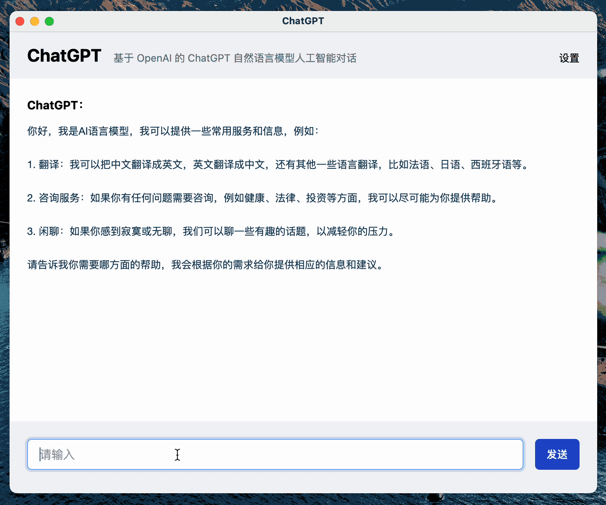

<p align="center">
    
</p>

<p align=center>An application developed on <b>UniAI</b>, inspired by <b>KimiChat</b>, integrated with multiple AI models.</p>

<p align=center> <a href="./README_CN.md">中文说明</a></p>

## Introduction

We admire [Moonshot](https://www.moonshot.cn/) and its product, [KimiChat](https://kimi.moonshot.cn/). Inspired by KimiChat, we have developed and open-sourced LeChat, a chat tool based on large models. LeChat closely follows KimiChat and provides almost identical functionalities.

Unlike KimiChat, which has its own large models and received a $1 billion investment from Sequoia Capital, our project may appear modest. We have no external investments and only one full-time engineer from an unknown research institute (myself) and a former intern who has since joined a tech giant. Currently, the project is maintained solely by me due to limited personal resources and funding. In the spirit of open source, we have made all the code for this project, including the frontend, backend, and core libraries, available for public use. We hope you enjoy it and consider giving us a star on GitHub, as it motivates us to continue maintaining the project.

Since we don't have our own large models, we are more flexible and can integrate with any model. If you wish to deploy this project, you will need to register with one of the following large model providers' APIs:

- Moonshot
- OpenAI GPT
- iFlyTek Spark
- Baidu WenXin Workshop
- Google Gemini
- ZhiPu AI GLM

You can also implement interfaces to integrate with more models by contributing to our other open-source project, [UniAI](https://github.com/uni-openai/uniai) core library development.

If you are an open-source enthusiast who does not want commercial models in your project, we also support ChatGLM-6B. To deploy it, please refer to: <https://github.com/uni-openai/GLM-API>. After deployment, follow the backend environment variable configuration section and add the GLM API address.

Furthermore, you may consider integrating Musk's [Grok-1](https://huggingface.co/xai-org/grok-1) on your own, which would require developing the UniAI core library as well.



Experience it here:

👉 [LeChat](https://lechat.cas-ll.cn)

Open-source repository:

👉 [UniAI-MaaS](https://github.com/uni-openai/uniai-maas)

Core library:

👉 [UniAI Core Library](https://github.com/uni-openai/uniai)


## Quick Start

*Note: This project requires the UniAI backend framework. <https://github.com/uni-openai/uniai-maas>*

Before you begin, make sure you have correctly installed the Node.js runtime environment. If you haven't installed Node.js yet, [click here to download](https://nodejs.org/).

Once you're ready, navigate to the project root directory and run the following commands to start the project:

```bash
npm install
npm run dev
```

Or

```bash
yarn
yarn dev
```

Upon successful execution, you will typically see (please refer to your specific output):

```bash
VITE v3.2.5 ready in 294 ms

➜ Local: http://localhost:5173/
➜ Network: use --host to expose
```
## Contributors
[Weilong Yu](https://github.com/mrkk1)

[Youwei Huang](https://github.com/devilyouwei)

Hold down `Ctrl` or `Command` and click on the Local link to open the project in your browser. You can then log in via QR code or mobile verification code to start using the application.
## Contributors

[Youwei Huang](https://github.com/devilyouwei)

[Weilong Yu](https://github.com/mrkk1)
If you intend to package the project for local deployment, [check here](/docs/electron-packaging-guide.md).

This project is licensed under the [MIT License](LICENSE).
