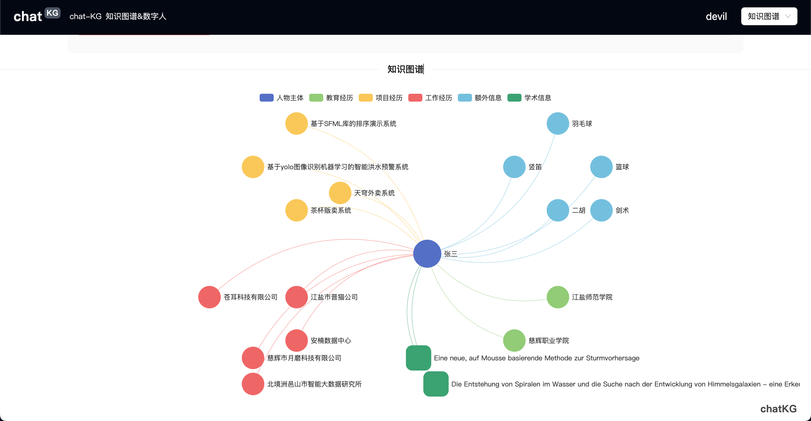

<p align="center">
    
</p>

<p align="center">
    An application developed on <b>UniAI</b> and inspired by <b>KimiChat</b>, featuring integration with multiple AI models.
</p>

<p align="center">
    <a href="./README_CN.md">中文说明</a>
</p>

## Introduction

We are inspired by [Moonshot](https://www.moonshot.cn/) and its product, [KimiChat](https://kimi.moonshot.cn). This led us to develop and open-source **[LeChat Pro](https://lechat.cas-ll.cn)**, a document parsing and Q&A chat platform based on generative AI models and knowledge graphs. LeChat Pro supports parsing of a full suite of Office documents, PDFs, images, and more, presented in a chat format similar to ChatGPT.

Our project is simple and community-driven, relying on open-source contributions to enhance functionality. We welcome you to join us in upgrading LeChat!

While we lack the resources to train our own large language models, this grants us flexibility in model choice, allowing integration with any model. Currently, **LeChat Pro** supports:

-   Moonshot
-   OpenAI
-   iFlyTek Spark
-   Baidu WenXin Workshop
-   Google Gemini
-   ZhiPu AI
-   Alibaba Tongyi Qianwen

You can connect additional models by contributing to our other open-source project, [UniAI](https://github.com/uni-openai/uniai), which is the core library for LeChat's multi-model support.

If you prefer open-source models over commercial ones, we offer support for the GLM model. For deployment, please follow the instructions at <https://github.com/uni-openai/GLM-API>, then configure the backend environment variables to add the **GLM_API** address.


**Experience it here:**

👉 <https://lechat.cas-ll.cn>

**Open-source backend repository:**

👉 <https://github.com/uni-openai/uniai-maas>

**UniAI Core Library:**

👉 <https://github.com/uni-openai/uniai>

**Mini Program Repository:**

👉 <https://github.com/uniai-lab/lechat-miniapp-v1>

## Features

-   🧠 Multi-model switching
-   📃 Complete Office file parsing
-   👀 Image recognition
-   🎨 Image generation
-   📈 Chart generation

## ChatKG Knowledge Graph

We are developing an innovative feature for chat based on knowledge graphs—**ChatKG**.



## Quick Start

_Note: This project requires the UniAI backend framework. [Deploy it here](https://github.com/uni-openai/uniai-maas)._

Before getting started, ensure you have Node.js installed. If not, [download it here](https://nodejs.org/).

Once set up, navigate to the project's root directory and run the following commands to start:

```bash
npm install
npm run dev
```

Or

```bash
yarn
yarn dev
```

Upon success, you will typically see output similar to:

```bash
VITE v3.2.5 ready in 294 ms

➜ Local: http://localhost:5173/
➜ Network: use --host to expose
```

Hold `Ctrl` or `Command` and click the Local link to open the project in your browser. You can log in with a QR code or mobile verification code to start using the application.

If you plan to package the project for local deployment, [see here](/docs/electron-packaging-guide.md).

## Contributors

[Weilong Yu](https://github.com/mrkk1)

[Youwei Huang](https://github.com/devilyouwei)

This project is licensed under the [MIT License](LICENSE).
